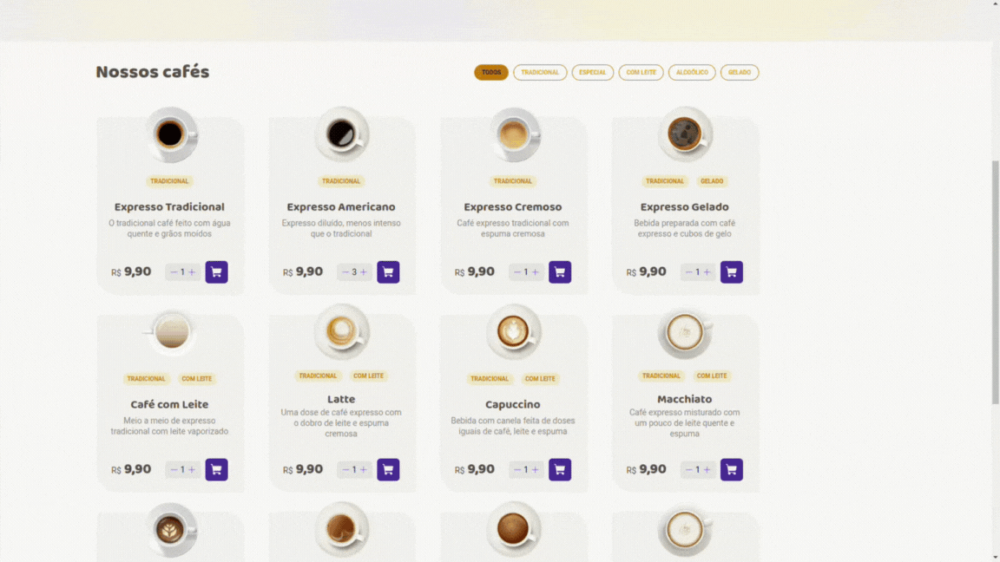
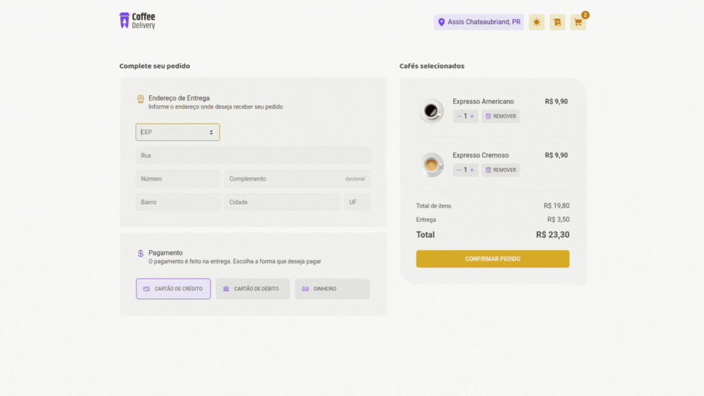
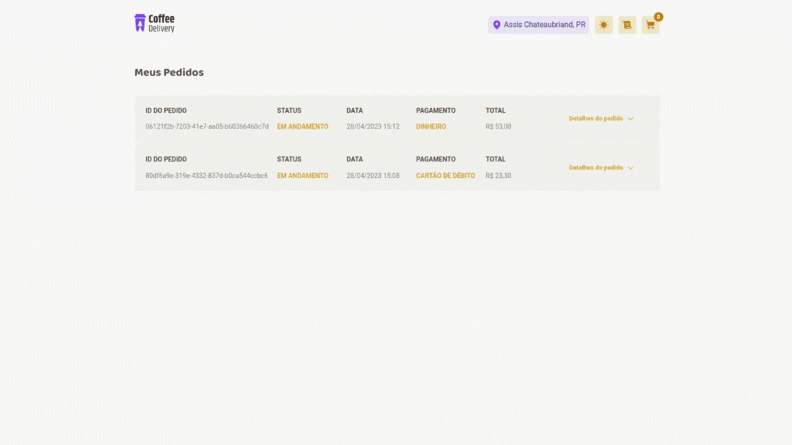

  

## Application developed to train my knowledge of React

---

## 🎥 Preview

## ☕ Listing all the coffee and filtering by category

---

## 🛒 Adding/removing items from the shopping cart

---

## 🚚 Placing a order

---

## 📜 Orders page (After 45 minutes the status is updated to done)

---

## 🌑 Dark mode

---

## 📱 Responsive pages

 

---

## 🚀 I went beyond the challenge

I did more than was requested to me

- ✔️ I created `responsive pages`
- ✔️ I created a `light/dark mode`
- ✔️ I added a `autocomplete to the city and UF by CEP`
- ✔️ I developed a `Orders page`
- ✔️ I added a `status to each order where after 45 minutes the status is updated to done`
- ✔️ I put `messages to notify the user when add/remove item to the cart`
- ✔️ I saved the `orders into the local storage`

 

---

## 📚 Learning

All the things that I learned and practiced with this project

- I learn `reducer` to manage complex states
- I learn `context API` to access states and functions easily
- I learn `React Router DOM` to create more than one page
- I learn `React Hook Form and Zod` to validate and authenticate forms

 

---

## 🧪 Technologies

This project was developed using de following technologies:

- [React](https://react.dev/)
- [React Hook Form](https://react-hook-form.com/)
- [Axios](https://axios-http.com/ptbr/)
- [Date-fns](https://date-fns.org/)
- [Immer](https://immerjs.github.io/immer/)
- [Phosphor Icons](https://phosphoricons.com/)
- [React Router DOM](https://reactrouter.com/en/main)
- [React Toastify](https://fkhadra.github.io/react-toastify/introduction)
- [Styled Components](https://styled-components.com/)
- [Zod](https://zod.dev/)
- [UUID](https://www.npmjs.com/package/uuid)

 

---

## 🔖 Layout

You can view the project layout through the links below:

- [Layout](https://www.figma.com/file/5yT9ZzZmRQRS4yivGGB3pl/Coffee-Delivery/duplicate)

Remembering that you need to have a [Figma](http://figma.com/) account to access it.

 

---

Developed by [ricardorhv](https://github.com/ricardorhv) 👋
